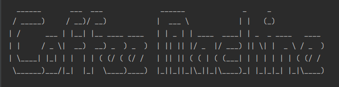

# coffee-machine

*** This is the Object-oriented Programming version of the Coffee Machine project ***  
  
1. Prompt user by asking what kind of coffee they want.  
2. Turn off the Coffee Machine if user enter "off".  
3. Print report if user enter "report".  
4. When the user chooses a drink, check resource sufficient.  
5. If there are sufficient resources, let the user know the drink cost and prompt the user to insert coins.  
6. Check if the money received is enough, and offer change if the user inserted too much money.  
7. If the transaction is successful and there are enough resources, make the coffee, and update resources.

  